# Game Content Reference

This page documents the gameplay content currently implemented by `nesylink`.
It is meant to help map authors and task authors understand what can be placed
in a room today.

## Player Character

The player is a Zelda-like dungeon adventurer with these default properties:

| Render | Property | Current behavior |
|---|---|---|
|  | Facing down | Default front-facing sprite. |
| 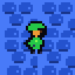 | Facing sideways | Used after horizontal movement. |
| 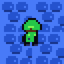 | Facing up | Used after upward movement. |

| Property | Current behavior |
|---|---|
| Position | Spawned from the room `default_spawn` entry, or from an exit entry when changing rooms. |
| Health | Starts with the default player HP from `core/constants.py`; traps and monsters reduce it. |
| Gold | Starts at zero and increases from gold chests or defeated monsters. |
| Keys | Starts at zero and is increased by key chests. Locked exits may consume keys. |
| Inventory | Starts with `sword` and `shield` unless task or dungeon `player_config` overrides it. |
| Slot A | Defaults to `sword`; first tries adjacent chest, NPC, or switch interaction, then uses the equipped A item. |
| Slot B | Defaults to `shield`; uses the equipped B item. |

Supported actions are wait, four-direction movement, slot A, and slot B. The
player faces the last movement direction, and the sword hitbox is one tile in
front of that facing direction.

## Items And Interactables

Objects are placed through room JSON under `objects`. Supported object kinds are
`chest`, `monster`, `trap`, `button`, `switch`, and `npc`.

| Render | Kind | Important fields | Function |
|---|---|---|---|
| 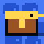 | `chest` | `loot` | Blocks movement until opened. Slot A opens an adjacent unopened chest and applies its loot. |
| 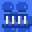  | `trap` | `trap_type`, `damage`, `respawn_to`, `respawn_delay_steps`, `single_use`, `pos`/`tiles`/`rects` | Damages the player on contact. `spike` respawns immediately at a spawn; `abyss` locks control briefly and respawns on a safe adjacent tile. |
| 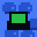 | `button` | `message` | Pressed by standing on it. Can satisfy a conditional exit requirement. |
|  | `switch` | `activation`, `effect` | Slot A interaction cycles a target dynamic object's state and emits switch/dynamic events. |
| 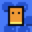 | `npc` | `text` | Blocks movement. Slot A next to it shows the NPC message. |
| 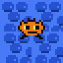 | `monster` | `monster_type`, `hp`, `damage` | Moving enemy. Contact damages the player unless the shield is active. |

Chest loot currently supports:

| Render | Loot kind | Fields | Effect |
|---|---|---|---|
|  | `key` | `amount`, `key_id` | Adds one or more keys and emits `key_collected`. `key_id` is metadata for authors. |
| 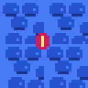 | `gold` | `amount` | Adds gold and emits `gold_collected`. |
| 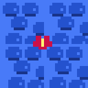 | `heal` | `amount` | Restores health up to max health and emits `agent_healed`. |
|  | `item` | `item_id`, optional `tool`, optional `equip_slot` | Adds an item name to inventory and emits `item_collected`. If `tool` is set, it also unlocks that equipment handler; `equip_slot: "A"` or `"B"` equips it immediately. |

Item image demos:

| Item image | Typical loot JSON | In-game meaning |
|---|---|---|
|  | `{"kind": "key", "amount": 1}` | Adds keys used by locked exits. |
|  | `{"kind": "gold", "amount": 1}` | Adds treasure currency. |
|  | `{"kind": "heal", "amount": 1}` | Restores player health. |
| 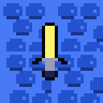 | `{"kind": "item", "item_id": "sword", "tool": "sword", "equip_slot": "A"}` | Adds and equips the sword tool. |
| 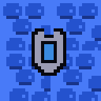 | `{"kind": "item", "item_id": "shield", "tool": "shield", "equip_slot": "B"}` | Adds and equips the shield tool. |

Chest image demos:

| Chest image | Suggested loot | Notes |
|---|---|---|
|  | `key` or `item` | Used for key chests and generic item/tool chests. |
| 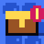 | `gold` | Used for treasure chests. |
| 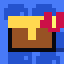 | `heal` | Used for healing chests. |

Equipment currently implemented:

| Render | Item | How it works |
|---|---|---|
|  | `sword` | Slot use creates a one-tile melee hitbox in the facing direction. Each hit removes 1 monster HP, applies knockback, stuns the monster, and kills it at 0 HP. |
|  | `shield` | Slot use raises the shield for a short action window. Contact with a monster during the active block prevents damage, knocks the monster back, and stuns it. |

Equipment handlers exist only for registered tools. Current registered tool
names are `sword` and `shield`. Item loot can put other names into
`inventory["items"]`, but only registered `tool` names can be used from slot A
or B.

## Traps And Dynamic Tiles

Trap objects default to `trap_type: "spike"`.

| Demo | Trap type | Runtime behavior | Events |
|---|---|---|---|
|  | `spike` | Deals `damage`; if the player survives, moves them to `respawn_to` or the room default spawn. | `trap_triggered`, `agent_damaged` |
|  | `abyss` | Deals `damage`; if the player survives, locks control for `respawn_delay_steps` or 2 steps and respawns on a safe adjacent tile. | `abyss_fall`, `trap_triggered`, `agent_damaged` |

Large trap areas can be authored with `tiles` or rectangular `rects`; the map
loader expands them into individual runtime traps with generated ids. A trap
with `single_use: true` deactivates after it triggers.

Dynamic objects are declared under room-level `dynamic_objects`, not
`objects`. The currently supported kind is `rotating_bridge`. Its active state
writes `bridge` tiles, while inactive states usually leave `gap` tiles.

| Demo | Dynamic tile | Runtime behavior |
|---|---|---|
|  | `gap` | Blocks movement and appears in observations. |
| 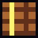 | `bridge` | Passable and prevents underlying traps from triggering on that tile. |

Switches can cycle dynamic object states with a `cycle_state` effect. A
successful switch interaction emits `switch_activated`,
`dynamic_object_state_changed`, and, for rotating bridges, `bridge_rotated`.

## Monsters

All monsters have `hp`, `damage`, a tile position, pixel movement, stun frames,
and contact damage. Sword hits and shield blocks both knock monsters back and
stun them. A killed monster grants the fixed monster kill gold reward and emits
`monster_killed`.

| Render | Monster type | Traits | Defeat method |
|---|---|---|---|
|  | `chaser` | Always moves toward the player, avoiding walls and blocking tiles. | Hit with the sword until HP reaches 0. Shield can block contact damage but does not reduce HP. |
|  | `patroller` | Moves around a square patrol route derived from `patrol_span`. | Time sword attacks around the patrol path; each sword hit removes 1 HP. |
|  | `ambusher` | Stays inactive until the player enters `ambush_range`, then chases. | Trigger or avoid the ambush range, then defeat with repeated sword hits. |

Example monster:

```json
{
  "id": "monster_1",
  "kind": "monster",
  "pos": [7, 4],
  "monster_type": "chaser",
  "hp": 2,
  "damage": 1
}
```

## Map Tiles And Observation Codes

Room layouts are 10 columns by 8 rows. The JSON `layout` supports only these
characters:

| Character | Meaning |
|---|---|
| `.` | Floor. |
| `#` | Wall. Blocks player and monster movement. |

The structured observation `obs["grid"]` uses numeric codes:

| Code | Meaning |
|---:|---|
| 0 | Empty floor |
| 1 | Wall |
| 2 | Player |
| 3 | Monster |
| 4 | Closed chest |
| 5 | Exit tile |
| 6 | Active trap |
| 7 | Button |
| 8 | NPC |
| 9 | Gap |
| 10 | Bridge |
| 11 | Switch |

Object rendering and the observation grid are derived from room state, not from
extra layout characters.

## Exits And Requirements

Exit directions are `north`, `south`, `west`, and `east`. Each direction maps
to a fixed two-tile doorway shape on the room edge.

| Exit type | Requirement behavior |
|---|---|
| `normal` | Always usable. |
| `locked_key` | Requires `key_count` keys and may consume them with `consume_key: true`. |
| `conditional` | May require a pressed button, an inventory item, all monsters defeated, and/or a key count. |

Set `complete_task: true` when reaching the exit should emit
`environment_completed` and end the episode as `world_completed`.

## Built-in Maps

| Map id | Main content | Objective shape |
|---|---|---|
| `mathematical_logic/task_1` | One key chest and one locked north exit. | Open the chest, collect the key, use the locked exit. |
| `mathematical_logic/task_2` | Trap borders, one key chest, one chaser, one conditional west exit. | Defeat the monster, collect the key, use the exit. |
| `mathematical_logic/task_3` | Three rooms with a monster hall and key room. | Collect the key, return to the start room, use the locked exit. |
| `mathematical_logic/task_4` | Rotating bridge, shield start, key, sword, guardian, and revealed chest. | Use bridge state, collect equipment, defeat the guardian, open the final chest. |
| `mathematical_logic/task_5` | Four rooms with gold, key, heal chest, button gate, locked key gate, NPCs, traps, and all monster types. | Explore and complete the chest objectives. |

## Authoring Notes

Use JSON maps for world content and Python tasks for training intent. A new task
usually combines:

- a `map_id` or `map_path`
- a `reward_id` or custom `reward_module`
- `max_steps`, `action_repeat`, and mission text

See `docs/reference/tasks-and-validators.md` for the task registry contract and
`docs/guides/map-creation.md` for room JSON examples.
